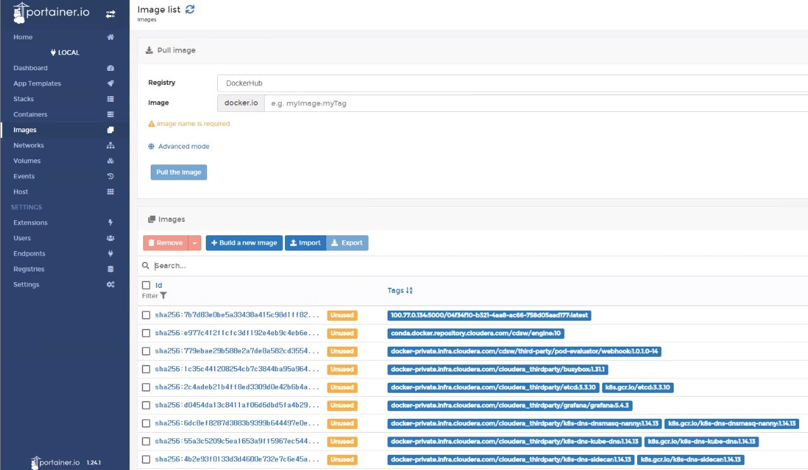

# cdsw-demo
CDSW 예제에 대한 설명


## R 예제

- impala 연동
- impala에서 데이터를 읽어와서 시각화

wget -nc https://raw.github.com/vincentarelbundock/Rdatasets/master/csv/MASS/Cars93.csv

```
CREATE EXTERNAL TABLE  Cars93  (  
NO     INT,
Manufacturer  STRING, 
Model  STRING,
Type  STRING,
Min_Price  FLOAT,
Price  FLOAT,
Max_Price FLOAT,
MPG_city  FLOAT,
MPG_highway FLOAT,
AirBags  STRING,
DriveTrain STRING,
Cylinders  STRING,
EngineSize FLOAT,
Horsepower FLOAT,
RPM        FLOAT,
Rev_per_mile       INT,
Man_trans_avail STRING, 
Fuel_tank_capacity    FLOAT,
Passengers    FLOAT,
Length         FLOAT,
Wheelbase       FLOAT,   
Width         FLOAT,
Turn_circle     FLOAT,
Rear_seat_room    FLOAT,
Luggage_room        FLOAT,
Weight         INT,
Origin         STRING,
Make         STRING )
COMMENT 'Cars93'
ROW FORMAT DELIMITED
FIELDS TERMINATED BY ','
LINES TERMINATED BY '\n'
STORED AS TEXTFILE;

LOAD DATA INPATH '/tmp/Cars93.csv' OVERWRITE INTO TABLE default.Cars93 ;


#system('wget -nc https://raw.github.com/vincentarelbundock/Rdatasets/master/csv/MASS/Cars93.csv')
#cars <- read.csv('Cars93.csv')
install.packages('odbc')
install.packages('DBI')

library(odbc)
library(DBI)
library(tibble)
library('ggplot2')

Sys.setenv('ODBCINI' = '/opt/cloudera/impalaodbc/Setup/odbc.ini'  ) 
Sys.setenv('ODBCSYSINI' ='/opt/cloudera/impalaodbc/Setup/' )
                      
con <- DBI::dbConnect(
  drv = odbc::odbc(), 
  dsn = "ImpalaDSN"
)  

cars <- dbGetQuery(con, "SELECT * FROM default.cars93 ")
cars$type <- as.factor( cars$type )
cars$mpg_city <- as.factor( cars$mpg_city )

head(cars)
class(cars$type)
summary(cars$type)
summary(cars)

# Explore
# -------
qplot(cars$mpg_city, main="Cars MPG City")
qplot(cars$mpg_city, cars$horsepower,
  main="City MPG vs. Horsepower",
  xlab="City MPG", ylab="Horsepower")
qplot(cars$wheelbase, cars$weight,
    main="Wheelbase Vs. Car Weight",
    xlab="Wheelbase", ylab="Car Weight") +
  geom_smooth(method = "loess")

```


- Jobs 메뉴에서 job 파이프라인 실행


## python 예제


기본 예제 - python_example.ipynb

- tips 데이터로 시각화
- 구글 지도 연동 
- impala 연동

Tensorflow2.x 예제 - tensorflow2.0_example.ipynb

Pytorch1.3 예제 - pytorch_example.ipynb

모델 서빙 예제

- 모델 학습

```
from sklearn import datasets, linear_model
from sklearn.metrics import mean_squared_error, r2_score
import pickle

import matplotlib.pyplot as plt

iris = datasets.load_iris()
test_size = 20

# Train
iris_x = iris.data[test_size:, 2].reshape(-1, 1) # petal length
iris_y = iris.data[test_size:, 3].reshape(-1, 1) # petal width

model = linear_model.LinearRegression()
model.fit(iris_x, iris_y)

# Test and predict
score_x = iris.data[:test_size, 2].reshape(-1, 1) # petal length
score_y = iris.data[:test_size, 3].reshape(-1, 1) # petal width

predictions = model.predict(score_x)

# Mean squared error
mean_sq = mean_squared_error(score_y, predictions)
print("Mean squared error: %.2f"% mean_sq)

# Explained variance
r2 = r2_score(score_y, predictions)
print('Variance score: %.2f' % r2)

# Output
filename = 'model.pkl'
pickle.dump(model, open(filename, 'wb'))

# 모델 생성 확인
! ls -l model.pkl
```

- 모델 서빙

```
import pickle

model = pickle.load(open('model.pkl', 'rb'))

def predict(args):
  petal_length = float(args.get('petal_length'))
  result = model.predict([[petal_length]])
  return result[0][0]
```

- Name : iris_model
- Description : iris_model

- Input :  {    "petal_length": 10 }
- output :   {    "result": 2 }


## pyspark 예제


## **Portainer** 

- custom 도커 이미지를 올리는 방법
- 이미지 관리

```
docker volume create portainer_data

docker run -d -p 9002:9000 -v /var/run/docker.sock:/var/run/docker.sock -v portainer_data:/data --restart=always portainer/portainer

# 접속
http://서버IP:9002
```





